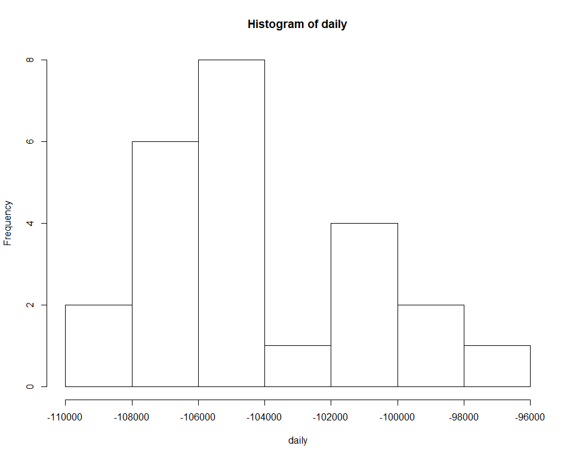
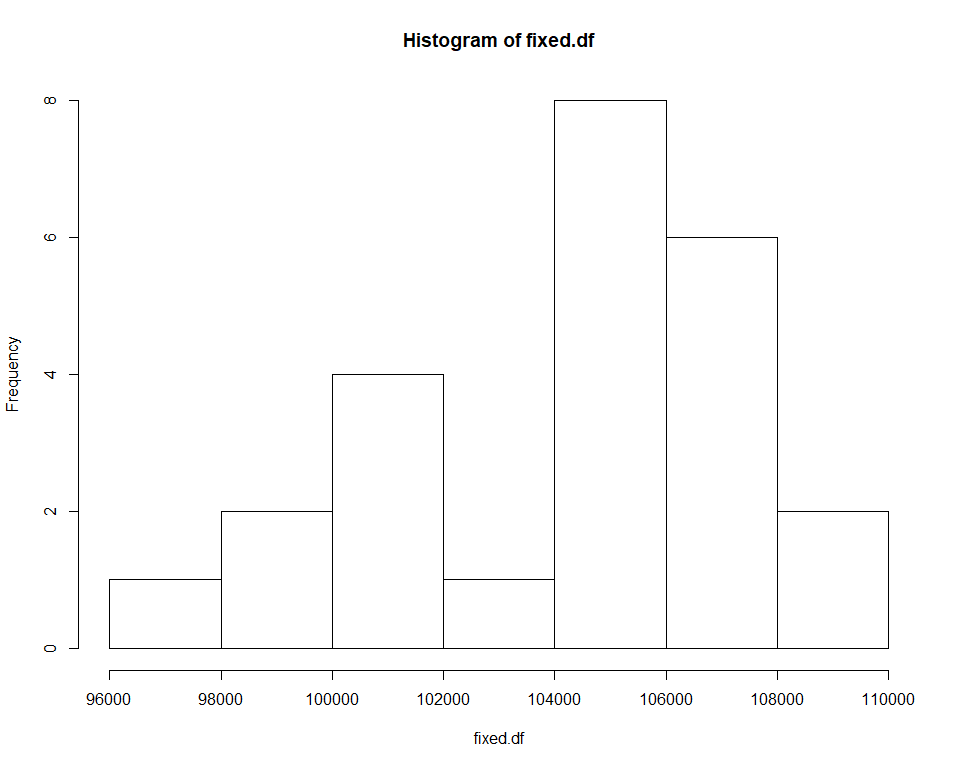

#Домашнее задание 1

##Работа с данными

По адресу http://www.stats.uwo.ca/faculty/braun/data/rnf6080.dat можно получить набор данных об осадках в Канаде с 1960 по 1980 годы. Необходимо загрузить эти данные при помощи read.table. Воспользуйтесь справкой, чтобы изучить аргументы, которые принимает функция.

1. Загрузите данные в датафрейм, который назовите ```data.df```.

    
    ```r
    data.df <- data.frame(read.table("rnf6080.dat"))
    ```
2. Сколько строк и столбцов в data.df? Если получилось не 5070 наблюдений 27 переменных, то проверяйте аргументы.

    
    ```r
    nrow(data.df)
    ## [1] 5070
    ncol(data.df)
    ## [1] 27
    ```


3. Получите имена колонок из ```data.df```.

    
    ```r
    names <- colnames(data.df)
    names
    ##  [1] "V1"  "V2"  "V3"  "V4"  "V5"  "V6"  "V7"  "V8"  "V9"  "V10" "V11"
    ## [12] "V12" "V13" "V14" "V15" "V16" "V17" "V18" "V19" "V20" "V21" "V22"
    ## [23] "V23" "V24" "V25" "V26" "V27"
    ```
    
4. Найдите значение из 5 строки седьмого столбца.

    
    ```r
    value <- data.df[5,7]
    value
    ## [1] 0
    ```
    
5. Напечатайте целиком 2 строку из ```data.df```

    
    ```r
    row2 <- data.df[2,]
    row2
    ##   V1 V2 V3 V4 V5 V6 V7 V8 V9 V10 V11 V12 V13 V14 V15 V16 V17 V18 V19 V20
    ## 2 60  4  2  0  0  0  0  0  0   0   0   0   0   0   0   0   0   0   0   0
    ##   V21 V22 V23 V24 V25 V26 V27
    ## 2   0   0   0   0   0   0   0
    ```
    
6. Объясните, что делает следующая строка кода ```names(data.df) <- c("year", "month", "day", seq(0,23))```. 


    Заменяет названия колонок на year, month, day и числа с 0 до 23 включительно
    
    
    Воспользуйтесь функциями ```head``` и ```tail```, чтобы просмотреть таблицу. Что представляют собой последние 24 колонки?
    
    
    
    ```r
    columns <- data.df[,tail(seq(ncol(data.df)), 24)]
    ```
      
    Последние 24 колонки – данные по дням

7. Добавьте новую колонку с названием daily, в которую запишите сумму крайних правых 24 колонок. Постройте гистограмму по этой колонке. Какие выводы можно сделать?

    
    ```r
    daily <- colSums(columns, na.rm=FALSE)
    hist(daily)
    ```
    
    <!-- -->
    
8. Создайте новый датафрейм ```fixed.df``` в котром исправьте замеченную ошибку. Постройте новую гистограмму, поясните почему она более корректна.
    
    Количество осадков не может быть отрицательным
    
    
    ```r
    fixed.df <- (daily*(-1))
    hist(fixed.df)
    ```
    
    <!-- -->
    
    

##Синтаксис и типизирование

1. Для каждой строки кода поясните полученный результат, либо объясните почему она ошибочна.

    
    ```r
    v <- c("4", "8", "15", "16", "23", "42")
    max(v) #Сравнение строк производится подобно сравнению слов 
    ## [1] "8"
    sort(v) #максимальная величина имеет наибольшее значение первого символа  
    ## [1] "15" "16" "23" "4"  "42" "8"
    #sum(v) – ошибка: нельзя складывать строки
    ```
    
2. Для следующих наборов команд поясните полученный результат, либо объясните почему они ошибочна.

    
    ```r
    v2 <- c("5", 7, 12)
    ##v2[2] + 2[3] – ошибка: нельзя складывать строки и числа. Вектор символов, потому что хотя бы один элемент задан строкой
    
    df3 <- data.frame(z1 = "5", z2 = 7, z3 = 12)
    df3[1,2] + df3[1,3]
    ## [1] 19
    ## 7 + 12 = 19
    
    l4 <- list(z1 = "6", z2 = 42, z3 = "49", z4 = 126)
    l4[[2]] + l4[[4]]
    ## [1] 168
    #42 + 126 = 168
    #l4[2] + l4[4] - ошибка: нельзя складывать list
    ```
    
##Работа с функциями и операторами

Оператор двоеточие создает последовательность целых чисел по порядку. Этот оператор — частный случай функции ``seq()``, которую вы использовали раньше. Изучите эту функцию, вызвав команду ``?seq``. Используя полученные знания, выведите на экран:

i. Числа от 1 до 10000 с инкрементом 372:

    
    ```r
    seq(1, 10000, 372)
    ##  [1]    1  373  745 1117 1489 1861 2233 2605 2977 3349 3721 4093 4465 4837
    ## [15] 5209 5581 5953 6325 6697 7069 7441 7813 8185 8557 8929 9301 9673
    ```

ii. Числа от 1 до 10000 длиной 50:

    
    ```r
    seq(1, 10000, length.out = 50)
    ##  [1]     1.0000   205.0612   409.1224   613.1837   817.2449  1021.3061
    ##  [7]  1225.3673  1429.4286  1633.4898  1837.5510  2041.6122  2245.6735
    ## [13]  2449.7347  2653.7959  2857.8571  3061.9184  3265.9796  3470.0408
    ## [19]  3674.1020  3878.1633  4082.2245  4286.2857  4490.3469  4694.4082
    ## [25]  4898.4694  5102.5306  5306.5918  5510.6531  5714.7143  5918.7755
    ## [31]  6122.8367  6326.8980  6530.9592  6735.0204  6939.0816  7143.1429
    ## [37]  7347.2041  7551.2653  7755.3265  7959.3878  8163.4490  8367.5102
    ## [43]  8571.5714  8775.6327  8979.6939  9183.7551  9387.8163  9591.8776
    ## [49]  9795.9388 10000.0000
    ```

      Функция ``rep()`` повторяет переданный вектор указанное число раз. Объясните разницу   между ``rep(1:5,times = 3)`` и ``rep(1:5, each=3)``.

    
    ```r
    rep(1:5, times = 3) #Повторяет всю последовательность
    ##  [1] 1 2 3 4 5 1 2 3 4 5 1 2 3 4 5
    rep(1:5, each = 3) #Повторяет каждый элемент
    ##  [1] 1 1 1 2 2 2 3 3 3 4 4 4 5 5 5
    ```
  
