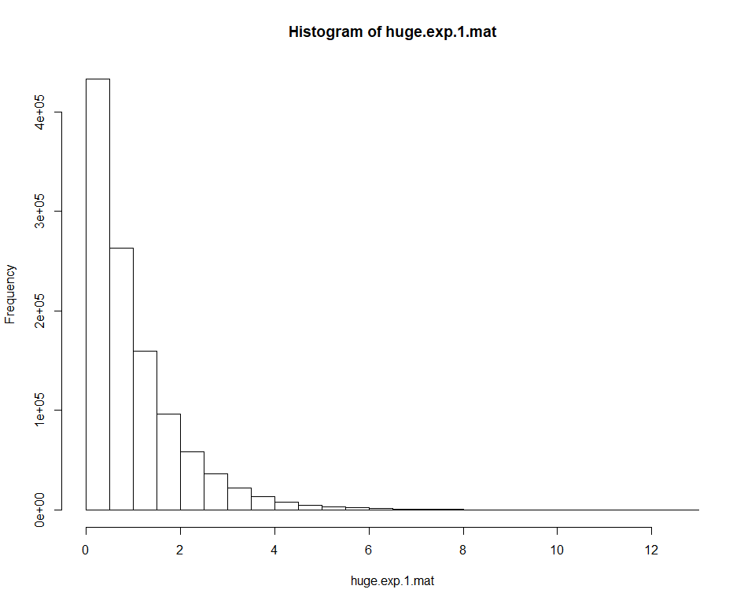

#Лабораторная работа 1

##Исходные данные
  
  Экспоненциальное распределение определяется следующей функцией распределения:
    ```
    F(x) = 1 - e^(-λ⋅x)
    ```
  Функция ```rexp``` генерирует случайные переменные при помощи экспоненциального распределения. ```rexp(n=42, rate=5)``` вернёт 42 экспоненциально-распределённых числа с параметром (λ) равным 5. Если второй аргумент не указан, будет использовано значение 1 т.е. получим “стандартное экспоненциальное распределение”.

##Задание 1

1. Сгенерируйте 200 случайных значений из стандартного экспоненциального распределения и сохраните в вектор __exp.1_. Найдите среднее и стандартное отклонение из данных этого вектора.

    Сгенерируем 200 значений и сохраним в вектор
    
    
    ```r
    exp.1 <- c(rexp(n=200))
    ```

    Найдём среднее значение и стандартное отклонение
    
    
    ```r
    mean1 <- mean(exp.1)
    mean1
    ## [1] 0.9656324
    
    std1 <- sd(exp.1)
    std1
    ## [1] 0.9586417
    ```

2. Повторите, использовав следующие значения параметра λ: 0.1, 0.5, 5, 10, и сохраните результаты в векторы:: _exp.0.1_, _exp.0.5_, _exp.5_, _exp.10_.
    
    
    ```r
    exp.0.1 <- c(rexp(n=200, rate = 0.1))
    exp.0.5 <- c(rexp(n=200, rate = 0.5))
    exp.5 <- c(rexp(n=200, rate = 5))
    exp.10 <- c(rexp(n=200, rate = 10))
    ```
    
3. Функция ```plot()``` общая функция для визуализации данных. Функция ```hist()```  принимает данные и раскладывает их по корзинам. Чтобы использовать эти функции нужно для начала передать им данные, которые хотим визуализировать.

4. Используйте функцию ```hist()``` для построения гистограммы полученного ранее стандартного распределения.

    
    ```r
    hist(exp.1, xlab = "Value")
    ```
    
    <!-- -->

5. Используйте функцию ```plot()``` с тем же самым вектором для построения графика значений в порядке следования.

    
    ```r
    plot(exp.1, xlab = "Index", ylab = "Value")
    ```
    
    <!-- -->

6. Используйте функцию ```plot()``` с любыми двумя полученными ранее векторами, чтобы получить диаграмму рассеяния (scatterplot) этих векторов относительно друг друга.

    
    ```r
    plot(exp.1, exp.0.5, xlab = "exp.1 values", ylab = "exp.0.5 values")
    ```
    
    <!-- -->


    ```
    ##Низкая отрицательная корреляция (low negative correlation) величин
    ```
    
7. Теперь сравним свойства всех наших векторов. Для начала создадим вектор, содержащий средние значения каждого из 5 полученных ранее распределений в порядке их создания. Полученный вектор сохраним в переменную  _exp.means_. 

    
    ```r
    exp.means <-c(mean(exp.1), mean(exp.0.1), mean(exp.0.5), mean(exp.5), mean(exp.10))
    ```
    
    
  Далее необходимо создать следующие диаграммы рассеяния:

 8. Вектор с пятью средними относительно каждого из пяти векторов с различными значениями λ.


    
    ```r
    lambdas <-c(1, 0.1, 0.5, 5, 10)
    plot(exp.means, lambdas)
    ```
    
    <!-- -->


    ```
    #Отрицательная корреляция
    ```
9. Вектор с пятью стандартными отклонениями относительно каждого из пяти векторов с различными значениями λ.

    
    ```r
    exp.stds <-c(sd(exp.1), sd(exp.0.1), sd(0.5), sd(exp.5), sd(exp.10))
    plot(exp.stds, lambdas)
    ```
    
    <!-- -->


```
#Отрицательная корреляция
```
10. Вектор с пятью средними относительно вектора с пятью стандартными отклонениями.


```r
plot(exp.means, exp.stds)
```

<!-- -->
```
#Положительная корреляция
```

#Задание 2
1. Для демонстрации сгенерируйте 1100000 (1 млн. 100 тысяч) чисел из стандартного экспоненциального распределения и сохраните их в вектор _huge.exp.1_. Получите среднее и стандартное отклонение.

    
    ```r
    huge.exp.1 <-c(rexp(n = 1100000))
    huge.mean1 <-c(mean(huge.exp.1))
    huge.std1 <-c(sd(huge.exp.1))
    ```
    
2. Получите гистограмму _huge.exp.1_. Она соответствует функции ``1 - e:^(-x)``? Должна ли?

    
    ```r
      hist(huge.exp.1)
    ```
    
    <!-- -->
    
    ```r
      #Форма схожа, но значения отличаются, поскольку распределение задано общей функцией, но для разного количества точек. 
    ```

3. Получите матрицу _huge.exp.1.mat_, содержащую 1100 строк и 1000 колонок. Постройте гистограмму, использовав полученную матрицу.
  
    
    ```r
    huge.exp.1.mat <- matrix(huge.exp.1, 1100, 1000)
    hist(huge.exp.1.mat)
    ```
    
    <!-- -->

4. Рассчитайте среднее 137-ой колонки из _huge.exp.1.mat_

    
    ```r
    mean(huge.exp.1.mat[,137])
    ## [1] 1.011631
    ```

5. Найдите среднее всей 1000 колонок и сохраните их в вектор. Отобразите диаграмму средних значений колонок. Объясните почему форма диаграммы отличается от виденных ранее.

    
    ```r
    huge.mat.means <- (apply(huge.exp.1.mat,2,mean))
    hist(huge.mat.means)
    ```
    
    <!-- -->

      Распределение не экспоненциальное, а нормальное. Потому что средние значения


6. Рассчитайте квадрат каждого значения из _huge.exp.1_ и найдите среднее и стандартное отклонение полученного вектора квадратов. Объясните отличие от соответствующих показателей вектора _huge.exp.1_. Вам может помочь формула, по которой R рассчитывает стандартное отклонение: _sqrt(sum((x - mean(x))^2) / (n - 1))_.

    
    ```r
    huge.exp.squares <- huge.exp.1^2
    huge.squares.mean <-c(mean(huge.exp.squares))
    huge.mean1
    ## [1] 0.9998278
    huge.squares.mean
    ## [1] 1.99769
    huge.squares.std <-c(sd(huge.exp.squares))
    huge.std1
    ## [1] 0.999017
    huge.squares.std
    ## [1] 4.447691
    ```

      С увеличением значений вектора увеличиваются и среднее значение. Значение стандартного отклонения увеличивается, поскольку значения вектора находятся в числителе дроби в формуле вычисления отклонения. 
